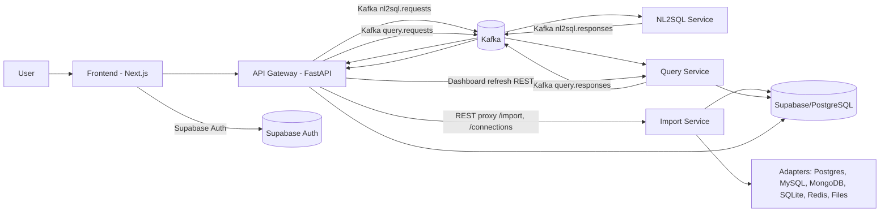

# SUMMARY - Agent SQL

Cập nhật theo code trong repository tại thời điểm đọc: **2026-05-16**.

## 1. Tổng quan dự án

**Agent SQL** là một hệ thống phân tích dữ liệu tự phục vụ dùng AI để chuyển câu hỏi ngôn ngữ tự nhiên thành truy vấn SQL, thực thi truy vấn an toàn, hiển thị kết quả dạng bảng/biểu đồ và hỗ trợ quản lý nguồn dữ liệu. Dự án hướng đến người dùng business/data analyst không cần viết SQL thủ công, đồng thời vẫn giữ lớp kiểm soát bảo mật ở backend để hạn chế truy vấn nguy hiểm.

Repository hiện là một full-stack app theo kiến trúc microservices:

- **Frontend**: Next.js, React, TypeScript, Supabase Auth, Recharts, Mermaid.
- **API Gateway**: FastAPI, điều phối request từ frontend, Kafka request/response, history, dashboard, speech-to-text và proxy import/connection.
- **NL2SQL Service**: FastAPI, multi-agent pipeline gồm Architect, SQL Generator, Validator, dùng Gemini/OpenAI/OpenRouter hoặc coordinator fallback.
- **Query Service**: FastAPI, validate SQL read-only, thực thi SELECT/CTE trên active data source, trả bảng kết quả.
- **Import Service**: FastAPI, kết nối/import dữ liệu từ PostgreSQL, MySQL, MongoDB, SQLite, Redis và file CSV/XLSX/JSON/Parquet/SQL dump vào Supabase/PostgreSQL.
- **Kafka**: message broker cho luồng AI async giữa gateway, NL2SQL và query.
- **Supabase/PostgreSQL**: nơi lưu metadata, dashboard, saved connections, bảng import và dữ liệu mẫu.

## 2. Mục tiêu sản phẩm

Dựa trên `docs/PRD.md`, sản phẩm đặt mục tiêu trở thành nền tảng self-service analytics:

- Người dùng nhập câu hỏi tự nhiên bằng tiếng Việt/Anh.
- AI phân tích schema, sinh SQL, giải thích câu SQL bằng ngôn ngữ dễ hiểu.
- Backend chặn các câu SQL ghi/xóa/sửa dữ liệu.
- Kết quả được hiển thị dưới dạng bảng, biểu đồ, dashboard và lịch sử.
- Admin/data engineer có thể kết nối nhiều nguồn dữ liệu, import file hoặc database, và giới hạn phạm vi dữ liệu đưa vào AI.

Nhóm persona chính:

- **End-user / business / PM / analyst**: cần hỏi dữ liệu nhanh, không muốn phụ thuộc hoàn toàn vào IT.
- **Admin / DBA / data engineer**: cần cấp quyền truy vấn an toàn, giới hạn tài nguyên, không để người dùng chạm trực tiếp database production.

## 3. Kiến trúc tổng thể



### Các port mặc định trong Docker Compose

| Thành phần | Port host | Port container | Vai trò |
|---|---:|---:|---|
| Frontend | `3000` | `3000` | UI Next.js |
| API Gateway | `8000` | `8000` | Entry point backend |
| Query Service | `8001` | `8000` | Validate và execute SQL |
| NL2SQL Service | `8002` | `8000` | Sinh SQL bằng AI |
| Import Service | `8003` | `8000` | Connect/import data |
| Kafka | `9092`, `9094` | `9092`, `9094` | Internal/external broker |
| Kafka UI | `8080` | `8080` | Quan sát topics/messages |

## 4. Cấu trúc thư mục chính

```text
.
├── frontend/                 # Next.js app, UI chính
├── services/
│   ├── api-gateway/          # FastAPI gateway, orchestration, dashboard, auth proxy
│   ├── nl2sql-service/       # AI multi-agent NL2SQL pipeline
│   ├── query-service/        # SQL validation + execution engine
│   └── import-service/       # Data connection/import service
├── database/                 # Schema SQL, seed Supabase, dashboard/connection schema
├── scripts/                  # Seed test databases, SQLite generator
├── test_data/                # CSV/JSON/Parquet/SQL sample data
├── docs/                     # PRD, roadmap, architecture, implementation docs
├── implementplan/            # Planning artifacts và QA strategy
├── image/                    # Screenshot/icon/media assets
├── docker-compose.yml        # Dev stack chính
└── docker-compose.test.yml   # Stack database test cho Connect Data Source
```

## 5. Luồng xử lý chính

### 5.1. Luồng hỏi AI NL2SQL

1. User nhập câu hỏi trong frontend.
2. Frontend gọi `POST /ask` ở API Gateway.
3. API Gateway tạo `correlation_id`, gửi message vào Kafka topic `nl2sql.requests`.
4. NL2SQL Service consume message, chạy pipeline:
   - **Architect Agent**: hiểu intent, chọn bảng/cột liên quan, lập query plan.
   - **SQL Generator Agent**: sinh SQL SELECT dựa trên schema và plan.
   - **Validator Agent**: kiểm tra SQL có đúng, an toàn, chỉ đọc.
5. NL2SQL Service trả kết quả vào `nl2sql.responses`.
6. API Gateway lấy SQL, tiếp tục gửi `query.requests`.
7. Query Service validate SQL lần nữa bằng rule-based validator rồi execute.
8. Query Service trả `columns`, `rows`, `row_count`, `error` nếu có.
9. API Gateway ghi query history và trả response về frontend.
10. Frontend hiển thị SQL preview, explanation, agent pipeline, table và chart.

### 5.2. Luồng chạy SQL thủ công

1. AI trả SQL ban đầu trong `SqlPreview`.
2. User có thể chuyển sang chế độ edit, sửa SQL và bấm run.
3. Frontend gọi `POST /query/manual`.
4. API Gateway gọi Query Service qua REST `POST /execute`.
5. Query Service vẫn dùng `validate_sql`, chỉ cho phép `SELECT` hoặc `WITH`.
6. Kết quả manual được lưu vào history với `source="manual"` và `sql_original`.

### 5.3. Luồng import database/file

1. User mở Connection Hub/Data Import trên frontend.
2. Frontend gọi Gateway `/import/*`; Gateway proxy sang Import Service.
3. Import Service tạo adapter theo loại nguồn:
   - PostgreSQL
   - MySQL
   - MongoDB
   - SQLite
   - Redis
   - CSV/XLSX/JSON/Parquet/SQL dump
4. Adapter test connection, list nguồn/bảng/collection/key-space/file sheets.
5. User chọn bảng/file source cần import.
6. Import Service đọc dữ liệu, ghi vào Supabase/PostgreSQL qua `SupabaseWriter`.
7. Bảng đích được tạo với tên dạng `imported_<source>_<suffix>`.
8. `public.import_registry` lưu metadata import.
9. Import Service tạo một saved connection loại `file` để scope dataset vừa import.
10. Service gọi `/schema/refresh` của NL2SQL để invalidate schema cache.

### 5.4. Luồng active connection/schema preview

1. Frontend gọi `/connections` để list connection từ Import Service qua Gateway proxy.
2. User bấm Use, frontend gọi `/connections/{id}/activate`.
3. Import Service set `is_active=true` trong `public.saved_connections`.
4. Query Service đọc active connection từ `public.saved_connections`.
5. Frontend có thể gọi `/connections/schema` để hiển thị schema và ERD.
6. Frontend có thể gọi `/connections/preview-data` để xem dữ liệu mẫu của từng bảng.

### 5.5. Luồng dashboard

1. Dashboard được lưu trong `app_private.dashboards`.
2. Widget chứa `title`, `sql_source`, `chart_type`, `fields`, `filters`.
3. Frontend gọi `/dashboards`, `/dashboards/{id}`, `/dashboards/{id}/refresh`.
4. Gateway refresh widget bằng cách gọi trực tiếp Query Service `POST /execute`.
5. `DashboardService.refresh` chạy nhiều widget song song bằng `asyncio.gather`.

### 5.6. Luồng speech-to-text

1. Frontend thu âm hoặc upload audio từ `HeroSearchInput`.
2. Frontend gọi `POST /speech/transcribe`.
3. Gateway dùng `SpeechToTextService`.
4. Hỗ trợ model local Whisper `base`, `small` hoặc Groq Whisper `whisper-large-v3`, `whisper-large-v3-turbo`.
5. Text transcript được đưa lại vào input câu hỏi.

## 6. Frontend

Frontend nằm trong `frontend/`, dùng Next.js App Router.

### Stack frontend

- Next.js `16.2.4`
- React `19.2.4`
- TypeScript
- Supabase SSR/Auth
- Recharts cho biểu đồ
- Mermaid cho ERD
- lucide-react cho icon
- CSS custom trong `src/app/globals.css`

### File chính

- `src/app/page.tsx`: màn hình dashboard/truy vấn chính.
- `src/app/login/page.tsx`: login/register bằng Supabase email/password và Google OAuth.
- `src/app/auth/callback/route.ts`: callback OAuth Supabase.
- `src/app/api/auth/register/route.ts`: route đăng ký server-side.
- `src/middleware.ts`: refresh Supabase session token.
- `src/lib/api.ts`: client API layer gọi Gateway.
- `src/lib/supabase.ts`: tạo Supabase browser client.
- `src/context/ToastContext.tsx`: toast notification.

### Component chính

| Component | Vai trò |
|---|---|
| `NavBar` | Thanh điều hướng, login/logout, mở kết nối |
| `HeroSearchInput` | Ô nhập câu hỏi, voice input, menu connect/import |
| `SqlPreview` | Xem/sửa/format/copy/chạy lại SQL |
| `AgentPipeline` | Hiển thị các bước Architect/Generator/Validator |
| `DataTable` | Bảng kết quả/preview, search, sort, filter null, export CSV, copy |
| `ChartVisualization` | Tự nhận diện hoặc chọn chart line/bar |
| `DataImport` | Modal import database/file |
| `ConnectionSidebar` | Quản lý saved connections, active connection |
| `ConnectionSwitcher` | Chọn, sửa, xóa, share connection từ dropdown |
| `ShareConnectionModal` | UI share connection theo email/role |
| `DatabasePreview` | Schema, ERD Mermaid, data preview |
| `MermaidERD` | Render ERD, zoom/pan/export |
| `DashboardPanel` | Render dashboard widgets và chỉnh widget |

### Trạng thái chính trong `page.tsx`

Frontend quản lý:

- session user/auth readiness;
- trạng thái query `idle/loading/success/error`;
- kết quả AI và kết quả manual SQL;
- dashboard hiện tại, widget data, widget loading/error;
- API health;
- active connection;
- modal import, sidebar connections, preview schema.

### API client

`frontend/src/lib/api.ts` gom các hàm:

- `askQuestion`, `explainSQL`, `runManualQuery`, `getHistory`;
- `listConnections`, `createConnection`, `updateConnection`, `testConnection`, `deleteConnection`, `activateConnection`, `getActiveConnection`;
- `getConnectionSchema`, `previewTableData`;
- `listImportRegistry`;
- `transcribeSpeech`;
- `createDashboard`, `listDashboards`, `getDashboard`, `updateDashboard`, `refreshDashboard`.

Client tự lấy Supabase session token và gắn `Authorization: Bearer <token>` nếu có. Nếu không có token, backend có fallback user.

## 7. API Gateway

Service nằm trong `services/api-gateway/`.

### Vai trò

- Entry point backend cho frontend.
- Quản lý CORS.
- Khởi động Kafka producer và response consumer khi app startup.
- Điều phối luồng `/ask`, `/explain`, `/query/manual`.
- Lưu query history vào file JSON.
- Quản lý dashboard CRUD/refresh.
- Proxy route import/connection sang Import Service.
- Speech-to-text.
- Hỗ trợ Supabase JWT auth.

### Endpoint chính

| Endpoint | Vai trò |
|---|---|
| `GET /` | Health root |
| `GET /health` | Health check |
| `POST /ask` | Câu hỏi tự nhiên -> SQL -> execute |
| `POST /explain` | Giải thích SQL |
| `POST /query/manual` | Chạy SQL do user chỉnh |
| `GET /history` | Lấy query history gần nhất |
| `POST /speech/transcribe` | Audio -> text |
| `POST /dashboards` | Tạo dashboard |
| `GET /dashboards` | List dashboard |
| `GET /dashboards/{id}` | Lấy dashboard |
| `PUT /dashboards/{id}` | Update dashboard |
| `POST /dashboards/{id}/refresh` | Refresh widget data |
| `/import/*` | Proxy sang Import Service |
| `/connections/*` | Proxy sang Import Service |
| `GET /debug/whoami` | Debug user id từ token/fallback |

### Kafka trong Gateway

- Producer gửi request vào `nl2sql.requests` và `query.requests`.
- Consumer lắng nghe `nl2sql.responses` và `query.responses`.
- Cơ chế correlation dùng `correlation_id` và dict `_pending` chứa `asyncio.Future`.

### Auth

`core/auth.py` có hai chế độ:

- `get_user_id`: verify Supabase JWT nếu `AUTH_REQUIRED=true`; nếu không có token thì fallback user.
- `get_optional_user_id`: cố gắng verify JWKS, nếu không được thì decode unverified để lấy `sub`, cuối cùng fallback user. Hàm này đang dùng cho proxy import/connection.

Biến môi trường liên quan:

- `SUPABASE_JWKS_URL`
- `SUPABASE_JWT_ISSUER`
- `SUPABASE_JWT_AUDIENCE`
- `AUTH_REQUIRED`
- `AUTH_FALLBACK_USER_ID`

### History

`core/history.py` ghi vào `query_history.json` theo cấu hình `HISTORY_FILE`. Mỗi entry gồm:

- `id`
- `timestamp`
- `question`
- `sql_query`
- `sql_original`
- `explanation`
- `success`
- `row_count`
- `duration_ms`
- `source`

## 8. NL2SQL Service

Service nằm trong `services/nl2sql-service/`.

### Vai trò

- Chuyển câu hỏi tự nhiên thành SQL.
- Trả explanation và intermediate agent steps.
- Có route REST trực tiếp và Kafka worker.
- Cache schema active trong 30 giây.
- Có nhiều provider LLM.

### Endpoint chính

| Endpoint | Vai trò |
|---|---|
| `GET /` | Root |
| `GET /health` | Health |
| `POST /generate-sql` | REST generate SQL |
| `POST /schema/refresh` | Xóa cache schema |
| `POST /explain` | Giải thích SQL |

### Pipeline agent

1. **ArchitectAgent**
   - Input: user query + schema.
   - Output: intent, selected tables, join hints, aggregation, filters, sorting, limit, query plan.

2. **SQLGeneratorAgent**
   - Input: user query + architect output + schema.
   - Output: `sql_query`, `explanation`.

3. **ValidatorAgent**
   - Input: user query + generated SQL + explanation + schema.
   - Output: `is_valid`, `is_safe`, issues, suggestions, corrected SQL/explanation, safety check.

### LLM provider

`core/llm_client.py` hỗ trợ:

- `GeminiClient`
- `OpenAIClient`
- `OpenRouterClient`
- `CoordinatorClient`

`CoordinatorClient` thử nhiều Gemini model/key, cooldown key lỗi, sau đó fallback sang OpenAI hoặc OpenRouter.

Biến môi trường chính:

- `LLM_PROVIDER`: `gemini`, `openai`, `openrouter`, `coordinator`
- `GEMINI_API_KEY`
- `GEMINI_KEYS`
- `GEMINI_MODELS`
- `GEMINI_TIMEOUT_MS`
- `GEMINI_COOLDOWN_S`
- `OPENAI_API_KEY`
- `OPENAI_MODEL`
- `OPENAI_BASE_URL`
- `OPENROUTER_API_KEY`
- `OPENROUTER_MODEL`
- `QUERY_SERVICE_URL`
- `KAFKA_BOOTSTRAP_SERVERS`

### Schema cache

`core/schema_cache.py` gọi `GET {QUERY_SERVICE_URL}/schema`. Nếu không có schema active, service không fallback sang schema hardcoded để tránh AI sinh SQL ngoài dataset active.

## 9. Query Service

Service nằm trong `services/query-service/`.

### Vai trò

- Validate câu SQL bằng rule-based validator.
- Chỉ cho phép `SELECT` hoặc `WITH`.
- Chặn DML/DDL và pattern nguy hiểm.
- Execute SQL trên active data source.
- Trả kết quả JSON-serializable.
- Cung cấp schema cho NL2SQL.

### Endpoint chính

| Endpoint | Vai trò |
|---|---|
| `GET /` | Root |
| `GET /health` | Health app |
| `GET /schema` | Schema active connection cho NL2SQL |
| `POST /schema` | Dynamic schema theo connection params |
| `POST /execute` | Execute SELECT query |

### SQL validator

`core/security.py` kiểm tra:

- query không rỗng;
- phải bắt đầu bằng `SELECT` hoặc `WITH`;
- chặn keyword: `INSERT`, `UPDATE`, `DELETE`, `DROP`, `ALTER`, `CREATE`, `TRUNCATE`, `GRANT`, `REVOKE`, `EXEC`, `MERGE`, `CALL`, `COPY`, `LOAD`, `REPLACE`, `UPSERT`;
- chặn pattern: multi-statement, SQL comments, block comments, stored procedure/system procedure, file read/write, sleep/benchmark/waitfor;
- strip trailing semicolon.

### Execution target

`QueryService.execute()` đọc active connection từ `public.saved_connections`:

- `db_type = file`: chỉ cho phép query trong phạm vi bảng import được lưu ở `database_name`.
- `db_type in postgresql/mysql/sqlite`: execute trực tiếp external SQL database bằng adapter executor.
- Không có active dataset: trả lỗi yêu cầu import hoặc chọn data source.

Với imported file/database đã ghi vào Supabase, Query Service dùng Supabase/Postgres default connection để query bảng `public.imported_*`.

### Schema

- `GET /schema` trả schema active connection.
- Với `file`, chỉ trả schema các bảng trong scope của dataset import.
- Với `postgresql`, `mysql`, `sqlite`, service cố gọi Import Service `/connections/schema`.
- Có hàm lấy full schema và dynamic Postgres/MongoDB schema trong `core/database.py`.

## 10. Import Service

Service nằm trong `services/import-service/`.

### Vai trò

- Kết nối nhiều nguồn dữ liệu.
- List bảng/collection/key/table/file sheet.
- Import dữ liệu vào Supabase/PostgreSQL.
- Quản lý saved connections trong `public.saved_connections`.
- Activate/deactivate connection.
- Trả schema active cho frontend/NL2SQL.
- Preview dữ liệu từng bảng.

### Endpoint import

| Endpoint | Vai trò |
|---|---|
| `GET /import/registry` | List bảng đã import |
| `POST /import/test-connection` | Test datasource |
| `POST /import/list-sources` | List tables/collections/sheets/virtual tables |
| `POST /import/execute` | Import tables từ datasource |
| `POST /import/upload-file` | Upload file và list source |
| `POST /import/execute-file` | Import file đã upload |

### Endpoint connection

| Endpoint | Vai trò |
|---|---|
| `GET /connections` | List saved connections của user |
| `POST /connections` | Tạo saved connection sau khi test |
| `DELETE /connections/{id}` | Xóa connection |
| `POST /connections/{id}/activate` | Chọn active connection |
| `POST /connections/deactivate` | Bỏ active connection |
| `GET /connections/active` | Lấy connection active |
| `POST /connections/{id}/test` | Test saved connection |
| `GET /connections/schema` | Schema active connection |
| `GET /connections/preview-data` | Preview data theo table |

### Adapter hỗ trợ

| Adapter | File | Ghi chú |
|---|---|---|
| PostgreSQL | `adapters/postgresql.py` | Hỗ trợ connection string, auto-encode user/pass trong URI |
| MySQL | `adapters/mysql.py` | List/read table qua PyMySQL |
| MongoDB | `adapters/mongodb.py` | List collections, flatten document, scan all non-system DB nếu không chỉ định database |
| SQLite | `adapters/sqlite_adapter.py` | Dùng path file SQLite |
| Redis | `adapters/redis_adapter.py` | Chuyển key types thành virtual tables |
| File | `adapters/file_adapter.py` | CSV, Excel, JSON, Parquet, SQL dump |
| SQL dump | `adapters/sql_adapter.py` | Parse CREATE TABLE, INSERT, PostgreSQL COPY stdin |

### Redis virtual tables

Redis được flatten theo type:

- `redis_strings`: `key`, `value`
- `redis_hashes`: `key`, `field`, `value`
- `redis_lists`: `key`, `index`, `value`
- `redis_sets`: `key`, `member`
- `redis_sorted_sets`: `key`, `member`, `score`

### Import writer

`core/supabase_writer.py`:

- sanitize tên cột và tên bảng;
- tạo tên bảng unique `imported_<source>_<8-char suffix>`;
- map type Python/Pandas sang PostgreSQL type;
- drop/create bảng đích;
- insert batch bằng `psycopg2.extras.execute_batch`;
- upsert metadata vào `public.import_registry`.

## 11. Database/schema

### Bảng dữ liệu mẫu

`database/seed.sql` tạo schema demo ecommerce:

- `users`
- `products`
- `orders`
- `order_items`

Kèm index cho orders/order_items/products và seed data từ tháng 01-08/2024.

### Dashboard schema

`database/dashboard_schema.sql` tạo:

- `app_private.dashboards`
- index theo `owner_id`, `updated_at`
- trigger `set_updated_at`

Dashboard row gồm:

- `id`
- `owner_id`
- `name`
- `description`
- `widgets` JSONB
- `created_at`
- `updated_at`

### Connection schema kiểu API Gateway

`database/connection_schema.sql` tạo:

- `app_private.connections`
- `app_private.connection_members`

Schema này dùng encrypted password `password_enc`, role `admin/viewer`, share member theo user.

### Connection schema kiểu Import Service

Import Service tự bootstrap bảng:

- `public.saved_connections`

Các cột chính:

- `id`
- `user_id`
- `name`
- `db_type`
- `host`
- `port`
- `database_name`
- `username`
- `password`
- `connection_string`
- `is_active`
- `created_at`
- `last_used_at`

### Import registry

Import Service tạo:

- `public.import_registry`

Các cột chính:

- `source_type`
- `source_name`
- `destination_table`
- `columns` JSONB
- `row_count`
- `imported_at`

## 12. Docker và hạ tầng local

### `docker-compose.yml`

Chạy toàn bộ stack dev:

- `import-service`
- `query-service`
- `nl2sql-service`
- `api-gateway`
- `frontend`
- `kafka`
- `kafka-ui`

Các service Python/Next dùng target `dev`, mount source code vào container để hot reload. Windows/Docker polling được bật bằng:

- `WATCHFILES_FORCE_POLLING=true`
- `WATCHPACK_POLLING=true`
- `CHOKIDAR_USEPOLLING=true`

Lệnh chạy:

```bash
docker compose up --build
```

### `docker-compose.test.yml`

Stack test datasource gồm:

- PostgreSQL test: host port `5433`, DB `shopdb`, user `testuser`, pass `testpass`
- MySQL test: host port `3307`, DB `shopdb`, user `testuser`, pass `testpass`
- MongoDB test: host port `27018`, DB `shopdb`
- Redis test: host port `6380`
- SQLite init tạo `/data/shopdb.db`

Lệnh chạy:

```bash
docker compose -f docker-compose.test.yml up -d
```

Lệnh xóa:

```bash
docker compose -f docker-compose.test.yml down -v
```

### Dockerfile

- Python services dùng multi-stage build, Python `3.10-slim`, virtualenv `/opt/venv`.
- Production runner tạo non-root user `python`.
- Frontend dùng `node:20-alpine`, production runner tạo user `nextjs`.
- Healthcheck có ở runner/dev compose.

## 13. Testing hiện có

### Query Service tests

`services/query-service/tests/test_query_service.py` test:

- valid SELECT;
- SELECT with WHERE/JOIN/CTE;
- reject INSERT/UPDATE/DELETE/DROP/ALTER;
- reject multi-statement;
- reject empty query;
- reject comment injection;
- API root health;
- map query errors.

### NL2SQL Service tests

`services/nl2sql-service/tests/test_nl2sql_service.py` kiểm tra endpoint/root và case generate SQL rỗng.

### API Gateway tests

`services/api-gateway/tests/` có test gateway và dashboard store.

### Test data

`test_data/` gồm:

- `employees.csv`
- `products.json`
- `sales_2024.parquet`
- `test_import.sql`
- script tạo parquet

`scripts/` gồm seed cho PostgreSQL, MySQL, MongoDB, Redis/SQLite.

## 14. Biến môi trường quan trọng

Không nên commit giá trị thật của secret/API key. Các biến đáng chú ý:

### Supabase/PostgreSQL

- `SUPABASE_DB_HOST`
- `SUPABASE_DB_PORT`
- `SUPABASE_DB_NAME`
- `SUPABASE_DB_USER`
- `SUPABASE_DB_PASSWORD`
- `NEXT_PUBLIC_SUPABASE_URL`
- `NEXT_PUBLIC_SUPABASE_ANON_KEY`

### Service URLs

- `NEXT_PUBLIC_API_URL`
- `NL2SQL_SERVICE_URL`
- `QUERY_SERVICE_URL`
- `IMPORT_SERVICE_URL`
- `KAFKA_BOOTSTRAP_SERVERS`

### Auth

- `SUPABASE_JWKS_URL`
- `SUPABASE_JWT_ISSUER`
- `SUPABASE_JWT_AUDIENCE`
- `AUTH_REQUIRED`
- `AUTH_FALLBACK_USER_ID`

### LLM/STT

- `LLM_PROVIDER`
- `GEMINI_API_KEY`
- `GEMINI_KEYS`
- `GEMINI_MODELS`
- `OPENAI_API_KEY`
- `OPENAI_MODEL`
- `OPENROUTER_API_KEY`
- `OPENROUTER_MODEL`
- `GROQ_API_KEY`
- `STT_MAX_FILE_MB`

### Query limits

- `QUERY_TIMEOUT_MS`
- `QUERY_MAX_ROWS`

## 15. Điểm mạnh hiện tại

- Kiến trúc tách service rõ: gateway, AI, query, import, frontend.
- Có Kafka request/response với `correlation_id` cho luồng AI async.
- Query Service có validator rule-based độc lập với validator agent LLM.
- Import Service hỗ trợ nhiều nguồn dữ liệu hơn README ban đầu: SQL DB, NoSQL, Redis, nhiều loại file.
- UI khá đầy đủ: auth, import, connection manager, schema preview, ERD, SQL editor, data table, charts, dashboard.
- Docker Compose dev có hot reload cho Windows/Docker.
- Có seed/test datasource riêng để demo Connect Data Source.
- Có định hướng sản phẩm rõ trong `docs/PRD.md` và `docs/ROADMAP.md`.

## 16. Lưu ý kỹ thuật và rủi ro trong code hiện tại

Đây là các điểm phát hiện khi đọc code, nên kiểm tra trước khi coi hệ thống là production-ready.

### 16.1. Có hai hệ thống connection song song

Code hiện có:

- `api-gateway/core/connection_store.py` dùng `app_private.connections` và `app_private.connection_members`, có mã hóa mật khẩu.
- `import-service/services/connection_service.py` dùng `public.saved_connections`, lưu password/connection string trực tiếp.

Trong `api-gateway/main.py`, router connection riêng của Gateway không được include; route `/connections/*` hiện đi qua `import_proxy_router.py` sang Import Service. Tuy nhiên `GatewayService._get_connection_params()` lại đọc từ `api-gateway/core/connection_store.py`. Điều này có thể gây lệch khi `/ask` nhận `connection_id` từ frontend nhưng Gateway lookup ở bảng khác với bảng Import Service đang quản lý.

### 16.2. Query Service có dấu hiệu mismatch tham số

`QueryExecuteRequest` có `connection_params`, Kafka worker cũng truyền `connection_params`, nhưng `QueryService.execute()` hiện chỉ nhận `sql: str`. Trong `query-service/core/kafka_worker.py`, lời gọi:

```python
query_service.execute(sql_query, connection_params=connection_params)
```

có thể gây `TypeError` nếu path này chạy. REST `/execute` cũng đang gọi `query_service.execute(request.sql_query)` và bỏ qua `request.connection_params`.

### 16.3. `POST /schema` trong Query Service thiếu import

`query-service/routers/query_router.py` dùng `db_manager` trong `POST /schema`, nhưng file không import `db_manager`. Endpoint dynamic schema theo connection params có thể lỗi runtime.

### 16.4. NL2SQL agents tham chiếu symbol chưa import

Các agent file có dòng `self.schema = DATABASE_SCHEMA`, và `nl2sql_service.py` dùng `DATABASE_SCHEMA`, `MONGO_VALIDATOR_AGENT_PROMPT`, `get_settings()` nhưng chưa import trực tiếp các symbol này trong các file tương ứng. Vì schema cache hiện được ưu tiên, một số branch có thể chưa chạm tới, nhưng agent constructor có thể lỗi `NameError` khi khởi tạo pipeline.

### 16.5. Active connection trong Query Service chưa scoped theo user

`query-service/core/active_connection.py` query:

```sql
SELECT * FROM public.saved_connections
WHERE is_active = true LIMIT 1
```

Không lọc theo `user_id`. Trong môi trường multi-user, user này có thể dùng active connection của user khác.

### 16.6. Import Service đang lưu password dạng plaintext

`public.saved_connections` có cột `password` và `connection_string`. Không thấy encryption layer trong Import Service. Trong khi schema `app_private.connections` của Gateway có `password_enc`, phần đó hiện không phải route connection chính đang được frontend dùng.

### 16.7. API Gateway optional auth có fallback decode unverified JWT

`get_optional_user_id()` có fallback decode token không verify signature để lấy `sub` nếu JWKS không cấu hình. Đây có thể chỉ phù hợp dev/local hoặc data isolation nhẹ, không đủ làm security boundary production.

### 16.8. Dashboard refresh không truyền connection context

`DashboardService._execute_widget_query()` gọi Query Service `/execute` chỉ với `sql_query`. Nếu dashboard cần chạy theo connection user cụ thể, cơ chế hiện tại phụ thuộc vào active connection global trong Query Service.

### 16.9. SQL limit là fetch limit, không phải rewrite LIMIT

Validator không tự rewrite SQL để thêm `LIMIT`. Query execution dùng `fetchmany(max_rows + 1)` để giới hạn rows trả về. Điều này bảo vệ response size nhưng database vẫn có thể chạy truy vấn nặng trước khi fetch xong.

### 16.10. README có vẻ bị lỗi encoding khi hiển thị trên PowerShell

File README chứa tiếng Việt nhưng khi đọc qua PowerShell có dấu hiệu mojibake. Nên kiểm tra encoding/editor nếu cần chỉnh README.

## 17. Gợi ý hướng hoàn thiện

Ưu tiên kỹ thuật nên xử lý theo thứ tự:

1. Quyết định một hệ thống connection chính: dùng `public.saved_connections` hoặc `app_private.connections`, không để Gateway và Import Service lệch nhau.
2. Scope active connection theo user trong Query Service.
3. Fix `QueryService.execute(connection_params=...)` hoặc bỏ hẳn connection_params khỏi Kafka path nếu đã chuyển sang active connection.
4. Fix import thiếu trong NL2SQL agents và Query Router.
5. Mã hóa password/connection string trong Import Service.
6. Cấu hình JWKS/Auth production và tránh unverified JWT decode cho route nhạy cảm.
7. Bổ sung integration tests end-to-end: import -> activate -> ask -> execute -> preview.
8. Thêm test cho dashboard refresh theo user/connection.
9. Cân nhắc rewrite SQL thêm `LIMIT` hoặc dùng database-side guard/cost timeout chặt hơn.
10. Chuẩn hóa docs/README encoding và cập nhật kiến trúc theo code hiện tại.

## 18. Cách chạy nhanh local

### Chạy app chính

```bash
docker compose up --build
```

Truy cập:

- Frontend: `http://localhost:3000`
- API Gateway docs: `http://localhost:8000/docs`
- Kafka UI: `http://localhost:8080`

### Chạy test databases

```bash
docker compose -f docker-compose.test.yml up -d
```

Kết nối từ UI khi service chạy trong Docker thường dùng host nội bộ theo service name:

- PostgreSQL: `test-postgres:5432`, DB `shopdb`, user `testuser`, pass `testpass`
- MySQL: `test-mysql:3306`, DB `shopdb`, user `testuser`, pass `testpass`
- MongoDB: `test-mongodb:27017`, DB `shopdb`
- Redis: `test-redis:6379`, DB index `0`
- SQLite: `/data/shopdb.db`

Kết nối từ host machine có thể dùng các port mapping:

- PostgreSQL: `localhost:5433`
- MySQL: `localhost:3307`
- MongoDB: `localhost:27018`
- Redis: `localhost:6380`

## 19. Một số câu hỏi demo

Sau khi import hoặc chọn data source mẫu, có thể thử:

- `Tổng doanh thu theo từng category`
- `Top 5 sản phẩm bán chạy nhất`
- `Doanh thu theo thành phố`
- `So sánh doanh thu tháng 1 và tháng 2`
- `Liệt kê các bảng hiện có trong database`
- `Sản phẩm nào còn tồn kho thấp nhất?`

## 20. Kết luận

Agent SQL hiện là một hệ thống NL2SQL/Data Analytics khá đầy đủ về mặt ý tưởng và module: có frontend giàu chức năng, microservices FastAPI, Kafka, import đa nguồn, dashboard, speech-to-text, schema preview và SQL safety layer. Phần cần ưu tiên nếu tiếp tục phát triển là làm sạch ranh giới giữa connection management, user isolation, dynamic schema và execution context; đây là các điểm quyết định để hệ thống chạy ổn định và an toàn trong môi trường nhiều người dùng.
