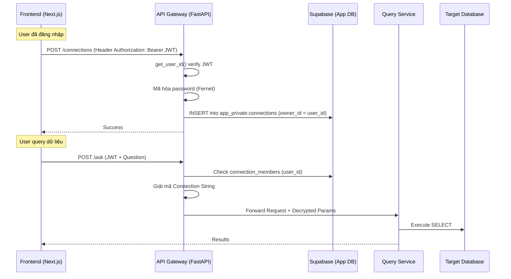

# Connection String Management & User Access Authorization

Xây dựng chức năng quản lý kết nối Database động và phân quyền truy cập. Chức năng này tích hợp trực tiếp với hệ thống **Auth (Supabase)** đã được triển khai hoàn tất.

> [!IMPORTANT]
> Hệ thống Auth đã sẵn sàng. Các API Gateway endpoints sẽ sử dụng `get_user_id()` dependency để xác thực JWT và trích xuất `user_id` (UUID) từ Supabase.

---

## User Review Required

> [!WARNING]
> **Các quyết định kỹ thuật đã thống nhất:**
> 1. **Mã hóa Connection String**: Sử dụng `cryptography.fernet` với `ENCRYPTION_KEY` lưu trong môi trường (env).
> 2. **Lưu trữ Connections**: Lưu trong schema `app_private` trên Supabase instance hiện tại để đảm bảo an toàn.
> 3. **Role system**: Hỗ trợ 2 role cơ bản `admin` (quản lý connection) và `viewer` (chỉ được thực thi query).
> 4. **User Identification**: Sử dụng định dạng `uuid` cho các trường `user_id` để khớp hoàn toàn với bảng `auth.users` của Supabase.

---

## Proposed Changes

### Tổng quan Kiến trúc Tích hợp Auth



---

### Phase 1: Database Schema (Migration)

#### [NEW] [connection_schema.sql](file:///home/traductoan/Seminar_Final/database/connection_schema.sql)

Cập nhật Schema sử dụng UUID để đồng bộ với Supabase Auth:

```sql
-- Bảng lưu connection configurations
CREATE TABLE app_private.connections (
  id            uuid PRIMARY KEY DEFAULT gen_random_uuid(),
  owner_id      uuid NOT NULL,                    -- ID từ auth.users
  name          text NOT NULL,
  db_type       text NOT NULL DEFAULT 'postgresql',
  host          text NOT NULL,
  port          integer NOT NULL DEFAULT 5432,
  database_name text NOT NULL,
  username      text NOT NULL,
  password_enc  text NOT NULL,                    -- Mã hóa Fernet
  ssl_enabled   boolean NOT NULL DEFAULT true,
  is_active     boolean NOT NULL DEFAULT true,
  schema_cache  jsonb DEFAULT '[]'::jsonb,
  settings      jsonb DEFAULT '{"timeout_ms": 30000, "max_rows": 500}'::jsonb,
  created_at    timestamptz NOT NULL DEFAULT now(),
  updated_at    timestamptz NOT NULL DEFAULT now()
);

-- Bảng phân quyền user
CREATE TABLE app_private.connection_members (
  id            uuid PRIMARY KEY DEFAULT gen_random_uuid(),
  connection_id uuid NOT NULL REFERENCES app_private.connections(id) ON DELETE CASCADE,
  user_id       uuid NOT NULL,                    -- ID người được share
  role          text NOT NULL DEFAULT 'viewer',   -- 'admin' | 'viewer'
  granted_by    uuid NOT NULL,
  created_at    timestamptz NOT NULL DEFAULT now(),
  UNIQUE (connection_id, user_id)
);

CREATE INDEX idx_connections_owner ON app_private.connections(owner_id);
CREATE INDEX idx_conn_members_user ON app_private.connection_members(user_id);
```

---

### Phase 2: Backend — API Gateway Hardening

#### [NEW] [encryption.py](file:///home/traductoan/Seminar_Final/services/api-gateway/core/encryption.py)
Logic mã hóa password bằng `cryptography`.

#### [MODIFY] [gateway_router.py](file:///home/traductoan/Seminar_Final/services/api-gateway/routers/gateway_router.py)
- Áp dụng `Depends(get_user_id)` cho các endpoint `/ask`, `/explain`, `/query/manual`.
- Thêm các endpoint quản lý connection `/connections`.

#### [MODIFY] [api.ts](file:///home/traductoan/Seminar_Final/frontend/src/lib/api.ts)
Cập nhật client để tự động gửi JWT Token:
```typescript
const { data: { session } } = await supabase.auth.getSession();
const token = session?.access_token;
// Gắn vào header Authorization
```

---

### Phase 3: Query Service Integration

#### [MODIFY] [query_service.py](file:///home/traductoan/Seminar_Final/services/query-service/services/query_service.py)
Chỉnh sửa để ưu tiên sử dụng `connection_params` nhận từ Gateway thay vì biến môi trường mặc định.

---

### Phase 4: Frontend UI (Data Bridge)

#### [MODIFY] [DataImport.tsx](file:///home/traductoan/Seminar_Final/frontend/src/components/DataImport.tsx)
Chuyển đổi logic giả lập sang gọi API thật tại `/connections`.

#### [NEW] [ConnectionManager.tsx](file:///home/traductoan/Seminar_Final/frontend/src/components/ConnectionManager.tsx)
Giao diện chuyển đổi giữa các Database mà user có quyền truy cập.

---

## Verification Plan

### Automated Tests
1. **Auth Check**: Gọi `/connections` không có JWT -> Phải trả về 401.
2. **Encryption Check**: Kiểm tra bảng `connections` trong DB, trường `password_enc` phải là ciphertext.
3. **Isolation Check**: User A không thể nhìn thấy connection của User B trừ khi được share.

### Manual Verification
1. Đăng nhập -> Tạo Connection đến một DB mẫu.
2. Thử hỏi một câu hỏi (NL2SQL) -> Kiểm tra dữ liệu có đúng từ DB đó không.
3. Chia sẻ quyền "Viewer" cho một account khác -> Account đó phải thực hiện được query nhưng không được sửa config.

---

## Thứ tự Triển khai Đề xuất

| Step | Task | Estimated |
|:---|:---|:---|
| 1 | Database Schema (migration SQL) | 15 min |
| 2 | Encryption module + unit test | 20 min |
| 3 | Connection Store (data access layer) | 30 min |
| 4 | Connection Service + Schemas | 30 min |
| 5 | Connection Router + mount vào app | 20 min |
| 6 | Query Service dynamic connection | 20 min |
| 7 | Gateway Service integration | 20 min |
| 8 | Frontend API functions | 15 min |
| 9 | DataImport upgrade (real API) | 30 min |
| 10 | ConnectionManager + MemberManager | 30 min |
| 11 | Skill + Agent files | 15 min |
| 12 | Integration testing | 30 min |
| **Total** | | **~4.5 hours** |
